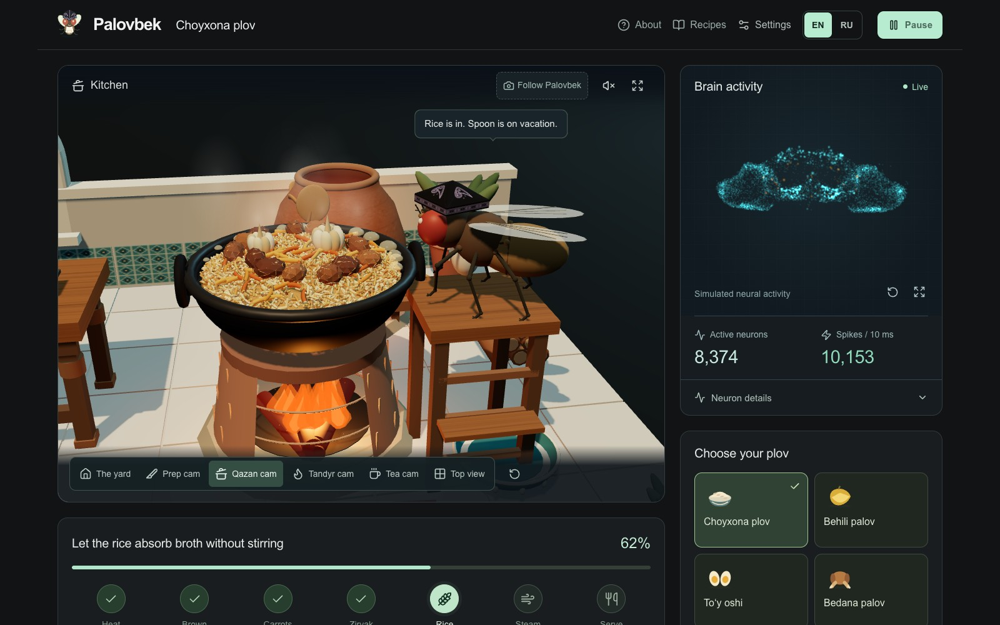
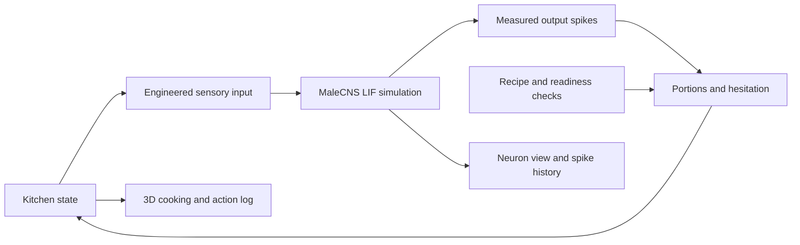

<p align="center">
  
</p>

<h1 align="center">Palovbek</h1>
<p align="center"><strong>166,700 neurons. Six legs. One qazan.</strong></p>
<p align="center">A fruit-fly connectome simulation meets an Uzbek kitchen.</p>
<p align="center">
  <a href="https://plov.mrz.sh">Watch him cook</a> ·
  <a href="docs/BROWSER_BRAIN.md">How the brain works</a> ·
  <a href="docs/README.ru.md">По-русски</a>
</p>

[](https://plov.mrz.sh)

[English clip](https://github.com/meerzulee/palovbek/releases/download/v1.0.0/palovbek-vertical.mp4) · [Русское видео](https://github.com/meerzulee/palovbek/releases/download/v1.0.1/palovbek-ru.mp4)

Square, kitchen-only clips: [English](https://github.com/meerzulee/palovbek/releases/download/v1.0.1/palovbek-square-en.mp4) · [Русский](https://github.com/meerzulee/palovbek/releases/download/v1.0.1/palovbek-square-ru.mp4)

Palovbek wears a **do‘ppi**, chops carrots, stirs the **zirvak**, layers rice, and waits beside a bubbling **qazan**. Sometimes he rubs his forelegs. Sometimes he has opinions about your portion sizes.

The kitchen and neural simulation run **in your browser**. No account, API key, Python server, or GPU rental is needed for the default experience.

> “The recipe says four portions. My cousins heard fourteen.”

## Try it

Open **[plov.mrz.sh](https://plov.mrz.sh)** and choose **Load weights · 79 MB**. Cooking starts when the model is ready. Verified model files are cached; a later visit starts a fresh session without another full download. Use the top toolbar to pause or start another plov.

- **Four recipes:** Choyxona plov, quince *behili palov*, wedding *to‘y oshi*, and stuffed-quail *bedana palov*.
- **A working 3D kitchen:** ingredient transfers, planted feet while chopping and stirring, fire, simmering broth, steam, a closing lid, tandyr, and an Uzbek porcelain tea set.
- **Measured activity:** a 3D sample of neuron positions, active-neuron counts, spike history, and an expandable neural readout.
- **Inspectable cooking:** quantities, timing, seed, neural measurements, and outcome in a downloadable JSON log.
- **English and Russian:** translated interface and chef comments, mobile controls, remembered language choice, and country defaults on Cloudflare.

## What is actually controlling the fly?

The browser runs a simplified **leaky integrate-and-fire model** over **166,700 MaleCNS neurons and 25,582,938 weighted connections**, adapted from [Xenova’s fruit-fly simulation](https://huggingface.co/spaces/Xenova/fruit-fly-simulation).

**The recipe supplies cooking order. Measured neural output influences portions and short pauses.** The simulated network has not learned to cook. The body animation, sensory mapping, recipe controller, toy kitchen physics, and dialogue are authored software. Dialogue is character writing, not decoded thoughts.



Continuous portions can vary by ±20%; whole-item counts stay fixed. The recipe checks browning and rice hydration, and never stirs after layering rice. No training run or newly trained weights are required. This is an independent creative experiment, not a claim of a conscious uploaded fly or a biologically validated chef.

The **Scripted cooking demo** starts automatically when WebGPU is unavailable and has a separately labeled decorative brain view. The optional Python experiment uses a different cohort; its measurements should not be confused with the browser model.

## Run locally

Use **Node.js 22.18+** and npm. The app was checked with Node 26 and Chrome on an Apple M5. A recent browser with WebGL2 is needed. The browser checks for a usable WebGPU device before loading the model. If unsupported, or if GPU initialization fails, the animated cooking demo starts automatically without claiming live neural activity. Allow several hundred MB of working memory in addition to the approximately 79 MB model download. Phone performance depends on the device.

```sh
git clone https://github.com/meerzulee/palovbek.git
cd palovbek
npm ci
npm run assets:prepare
npm run dev
```

Open **http://localhost:5173** and load the brain. Keep the tab open while cooking; background tabs can be suspended.

`assets:prepare` downloads from a pinned upstream commit, verifies SHA-256 hashes, retries failed requests, and repairs incomplete files. Generated assets, caches, and model binaries are excluded from Git. `npm run build` runs this preparation automatically.

## Verify it yourself

```sh
npm test
npm run build
npm run check:static

# Browser tests; skip this installation if using the detected macOS Chrome.
npx playwright install chromium
npm run test:e2e
```

The browser suite includes a full recipe using the actual graph, a corrupt-download recovery check, pause/resume, caching, English/Russian controls, mobile layout, and checks for tool grips, grooming, fire, and the lid. The full wedding cook takes around six minutes on the tested M5. Optional Python tests are skipped unless enabled explicitly.

To reproduce the numerical propagation audit, start `npm run dev`, then run:

```sh
node scripts/audit-browser-engine.mjs
```

Set `PLAYWRIGHT_CHROMIUM_EXECUTABLE_PATH` if Chrome lives elsewhere. Read the [browser audit](docs/BROWSER_BRAIN.md) and [complete cooking report](docs/results/browser-wedding.json). A full-graph CPU/GPU comparison differed by one spike at one neuron; these checks do not establish biological accuracy or identical trajectories across devices.

## Deploy your own copy to Cloudflare

Cloudflare serves the app, connectome, kernels, and license files. A small Worker chooses the initial language. **The visitor’s browser runs the brain**, so an always-on model server is unnecessary. Each visitor has an independent session, not a shared 24/7 cooking process.

Before deploying, edit `wrangler.jsonc`:

1. Change `name` to your own Worker name.
2. Replace the `plov.mrz.sh` custom domain in `routes` with a domain in your Cloudflare account, or remove `routes` and set `"workers_dev": true` to use a `workers.dev` address.

```sh
npx wrangler login
npm run build
npm run check:static
npx wrangler deploy --dry-run
npm run deploy

# Check your published site, including real spikes and cached reload:
PALOVBEK_URL=https://your-host.example npm run check:production
```

Do not rename model `.dat` files to `.gz`: the loader expects the original compressed bytes. Plain static hosting also works, with browser-language defaults if `/api/locale` is absent. See [hosting requirements and deployment details](docs/HOSTING.md).

## Record a cooking clip

The repository includes the recording and editing scripts used for the launch clip. They record the **real browser model**, retain measured activity, and edit out waiting time. They require Chrome/Playwright and `ffmpeg`/`ffprobe` on your PATH; no Python brain server is started.

```sh
npm run build
npm run preview -- --port 4173
# In another terminal:
npm run media:record
npm run media:edit
# Russian recording with a compact header and neuron count:
PALOVBEK_LANG=ru PALOVBEK_MEDIA_DIR=artifacts/social-ru npm run media:record
PALOVBEK_MEDIA_DIR=artifacts/social-ru npm run media:edit
# Square kitchen-only clips, with English or Russian speech bubbles:
PALOVBEK_FORMAT=square PALOVBEK_LANG=en PALOVBEK_MEDIA_DIR=artifacts/square-en npm run media:record
PALOVBEK_MEDIA_DIR=artifacts/square-en npm run media:edit
PALOVBEK_FORMAT=square PALOVBEK_LANG=ru PALOVBEK_MEDIA_DIR=artifacts/square-ru npm run media:record
PALOVBEK_MEDIA_DIR=artifacts/square-ru npm run media:edit
```

Outputs go to the selected `PALOVBEK_MEDIA_DIR` (default `artifacts/social/`): a full WebM capture, an H.264 MP4 highlight, a cover image, and a capture log. `PALOVBEK_FORMAT=square` records the kitchen and translated speech bubbles at 1080 × 1080, without dashboard or title overlays; the default is vertical. The recording changes presentation CSS only. The edited clip uses cuts at normal playback speed; it is not one uninterrupted cook. Launch media are available in the [release downloads](https://github.com/meerzulee/palovbek/releases).

## Explore the code

| Location | What it does |
| --- | --- |
| `src/browserBrain.worker.ts` | Model lifecycle, neural steps, telemetry, and cooking log |
| `src/browserKitchen.ts` | Recipe order, actions, quantities, and serving checks |
| `src/neuralChoice.ts` | Output-spike mapping to portion size and hesitation |
| `src/KitchenScene.tsx`, `src/flyRig.ts` | Courtyard, fly anatomy, animation, and camera |
| `src/zirvak.ts`, `src/teaSet.ts` | Qazan effects and procedural porcelain |
| `src/chefHumor.ts`, `src/ru.json` | Palovbek’s dialogue and Russian translation |
| `src/vendor/xenova/` | Pinned browser engine, manifests, and original license |
| `shared/recipes.json` | Regional recipe catalog and quantities |
| `worker/index.ts` | Cloudflare language endpoint |
| `brain/` | Optional local Python experiment |

For the separate Python setup and checkpoint experiments, see [the implementation guide](docs/NEURAL_IMPLEMENTATION.md) and [hosting notes](docs/HOSTING.md#optional-shared-server-if-wanted-again). It downloads a larger dataset and is not required to run or host the browser version.

## Credits and license

Original Palovbek code is [MIT licensed](LICENSE). Third-party code and data retain their own licenses.

- **Xenova:** [browser simulation](https://huggingface.co/spaces/Xenova/fruit-fly-simulation), pinned to `776d115ee5aa934578a87fd6d260d138084f59c1`; original MIT notice preserved.
- **MaleCNS:** FlyEM / HHMI Janelia, University of Cambridge, MRC Laboratory of Molecular Biology, Google Research, and collaborators. Connectivity and coordinates are a **CC BY 4.0** derivative; see [attribution and transformations](THIRD_PARTY.md).
- **Shiu and colleagues:** the [computational brain model](https://www.nature.com/articles/s41586-024-07763-9) informs the model approach and optional Python reference checks.
- **Hugging Face kernels:** Apache 2.0. **Three.js, React, and Lucide:** their respective distribution notices apply.
- **Uzbek cooking:** [recipe sources and preparation assumptions](docs/RECIPES.md).

This project is independent of the upstream teams. Full notices and source pins are in [THIRD_PARTY.md](THIRD_PARTY.md) and [the engine audit](docs/BROWSER_BRAIN.md).
