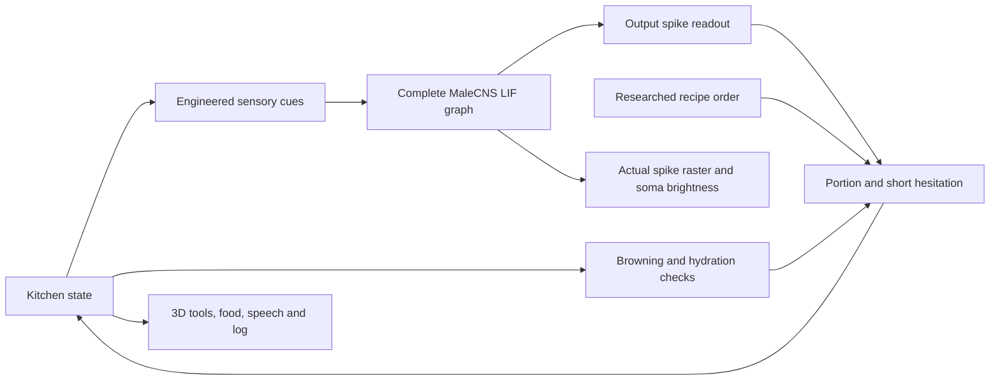

# Browser brain: implementation and audit

The default experience runs locally in the visitor’s browser. Cloudflare only serves files. Each visit gets a fresh session that begins cooking automatically after initialization. On page load, the app checks the actual Cache Storage keys against every pinned metadata/connection chunk hash. If any file is missing, a modal opens automatically; with a complete cache, a fresh brain initializes and starts cooking in the background without showing it. The worker still verifies the cached bytes before use. **Initialize brain** or **Load browser brain** reopens a dismissed modal; **Load weights · 79 MB** explicitly starts the download. The modal shows chunk verification, engine initialization, failures with retry, cancellation, and readiness. It can be closed to continue loading in the background. The modal closes automatically when initialization succeeds and Choyxona plov starts. A sticky toolbar above the kitchen provides pause/resume and another-cook controls, including on mobile. Selecting another recipe changes **Choose your plov** to **Cook this plov**, which starts that recipe immediately. Explicit resets and pauses do not trigger automatic restart. A blocked cache shows the first-visit loader, and initialization failures reopen it for retry. There is no hosted Python requirement, model API, account, or training service.

## What we checked

Source: [Xenova/fruit-fly-simulation](https://huggingface.co/spaces/Xenova/fruit-fly-simulation), pinned commit `776d115ee5aa934578a87fd6d260d138084f59c1`. The independent audit checkout is `../plov-fly-audit/xenova-fruit-fly` on this machine. Its original file hashes, our changes, and every distributed asset hash are recorded in `src/vendor/xenova/sources.lock.json`.

It computes a leaky integrate-and-fire model using **166,700 MaleCNS neurons, 25,582,938 directed weighted edges, and a retained synapse-weight sum of 124,177,617**. These counts differ from our optional Python cohort (167,216 neurons). The upstream browser cohort selects annotation rows with a non-null superclass. We do not silently equate these two engines or their numerical results.

The audit ran the actual imported complete graph in Chrome 152 on this Apple M5:

| 50 ms neural experiment | Spikes | Distinct cells fired | Spikes outside stimulated LC9 cells |
|---|---:|---:|---:|
| Rest, no external input | 0 | 0 | 0 |
| 219 LC9 cells stimulated at 180 Hz | 7,560 | 3,371 | 5,636 |
| Same stimulation, recurrent transmission off | 1,924 | 219 | 0 |

The CPU state stayed finite. The upstream 257-cell GPU check passed 1,600 timesteps, including inhibitory connections and transmission-off trials. Maximum voltage error was about 0.000057 mV. On the complete graph, GPU returned 7,561 versus CPU’s 7,560 spikes, differing at **one neuron**. Thus we verified functioning propagation, but **not bit-identical complete-graph CPU/GPU results**. Floating-point threshold sensitivity can affect a later trajectory. A passing numerical fixture is not biological validation.

Complete-graph LC9 timing was approximately 0.172 s CPU and 0.085 s GPU for 0.05 neural seconds in this short test. These are short measured trials, not sustained speed or mobile capacity guarantees. Raw measurements: [xenova-browser-audit.json](results/xenova-browser-audit.json). The numerical audit can also be reproduced directly against the vendored engine in this repository. Run `npm run dev`, then `node scripts/audit-browser-engine.mjs`. It reads the same pinned data and writes `docs/results/browser-engine-audit.json`, preserving the original upstream audit. `AUDIT_URL` selects the dev server; `AUDIT_MODULES` and `AUDIT_ASSETS` optionally select another checkout’s served module/data roots. `AUDIT_OUTPUT` selects the output report. A Chrome executable can be supplied with `PLAYWRIGHT_CHROMIUM_EXECUTABLE_PATH`. Production builds are tested by the full kitchen end-to-end test; the numerical audit uses dev-served source modules.

## Reuse and licenses

The Space metadata advertises `apache-2.0`; its actual root `LICENSE` and README explicitly identify **original application code as MIT**. The repository is a mix of licenses, not uniformly Apache. We retain the original MIT notice, all supplied dependency notices, attribution, and a list of modifications.

| Included material | License / condition |
|---|---|
| Xenova brain, loader, checks, stimulus helpers | MIT; preserve copyright and permission notice |
| MaleCNS connectivity, annotations, coordinates | CC BY 4.0; credit contributors, link source/license, identify adaptations |
| Hugging Face kernel package and kernel templates | Apache 2.0; preserve license and applicable notices; identify modifications |
| Three.js | MIT; preserve notice |

The [official MaleCNS download page](https://male-cns.janelia.org/download/) identifies its data as CC BY. [CC BY 4.0](https://creativecommons.org/licenses/by/4.0/) permits reuse and adaptation, including commercial reuse, with its attribution conditions. Our UI links the distributed notices and graph provenance. See [THIRD_PARTY.md](../THIRD_PARTY.md). We use our existing fly and kitchen; the upstream NeuroMechFly body, fonts, and gait are not incorporated.

## Download bugs and fixes

1. **Double decompression:** upstream Vite 8 serves `.gz` with `Content-Encoding: gzip`. Fetch transparently decodes it, then the loader’s `DecompressionStream('gzip')` fails. We reproduced this. The distributed files now end in `.dat`; their compressed payload bytes and SHA-256 hashes are unchanged. The manifest points to the renamed files, so HTTP delivers exactly the bytes the loader expects. The separate audit checkout also has middleware fixing raw `.gz` delivery in development.
2. **Late dependency optimization:** the first dynamic GPU import caused Vite to optimize `@huggingface/kernels` and reload the page, losing initialization state. It is now explicitly included in `optimizeDeps`.
3. **Integrity recovery:** corrupt cached chunks are evicted. A bad download, gzip signature, or decompression failure retries that one chunk up to twice, without discarding verified chunks. Transient network errors have bounded retry/backoff. Metadata now has its own checksum, in addition to the connection-array checksums.
4. **Retryable setup:** startup failures return to the load control with a message. A stalled initialization is terminated, and a new worker reuses verified cached files. Browser storage is optional; restricted/private storage does not block initialization.
5. **Fresh checkouts:** `npm run assets:prepare` downloads only from the pinned commit, checks every byte, and atomically replaces incomplete assets. It also detects Git LFS pointers as checksum failures. Production builds invoke it automatically.

Weights total about **79.0 MB as stored compressed assets**. Each individual chunk is below Cloudflare’s 25 MiB static-asset limit. The browser additionally holds graph arrays, neuron metadata and simulation state, and WebGPU allocates GPU buffers. Expect several hundred MB of memory. The UI reports an **array-memory estimate**, not measured whole-browser RSS. A small-screen layout test is not a test of a low-memory phone.

## Who decides what

`BrowserKitchen` checks the current world rather than using a prerecorded success timeline. It transports oil, waits for heat, fries onion and lamb, checks browning, chops carrots three times, builds zirvak, adds regional ingredients, layers rice, lowers heat, covers, steams, turns off the fire, rests, uncovers, garnishes, and serves. It never stirs after adding rice. See [RECIPES.md](RECIPES.md).

**The network has not learned cooking.** An engineered readout uses measured left/right descending-and-motor population spikes to select a portion factor in `[0.8, 1.2]`. Mean output firing sets a short hesitation of zero, one, or two kitchen seconds before pickup. No output spikes yields a documented neutral portion and a two-second wait. Whole bulbs, eggs, quince pieces, and birds retain their integer recipe counts; grams, millilitres, and cumin teaspoons vary. Browning and hydration time depend on the selected meat and rice quantities. The recipe constrains order and readiness; it does not conceal a trained culinary policy.

Input mappings are explicit in `src/browserBrain.worker.ts`: ingredient proximity drives selected ORN types, heat drives TRN_VP1m, held contact drives BM, prep and qazan views drive LC9 and LC4, smoke drives ORN_DC4, and moisture shares a small ORN_DM1 subset as an engineered proxy. These mappings do not assert that flies naturally recognize oil, plov, or kitchen stations. We retain upstream monoamine signs (+1), histamine/unknown omission, and model parameters. Seed is passed into both the CPU PRNG and the GPU uniform; upstream GPU had hardcoded seed 1.

A worker update integrates 100 timesteps (10 ms neural time), then advances 0.25 toy kitchen seconds. These clocks are explicitly different. Rendering interpolates only received states; paused time does not generate new spikes or advance a gesture. The fly plants four supporting legs during chopping and stirring. Tool motion and speech are authored visualization.

## Activity and records

- Every cell participates in the graph computation. The 3D window displays a deterministic sample of actual soma locations in the brain; the nerve cord still participates in the simulation.
- The default view keeps the 3D brain and two activity counters visible. Expand **Neuron details** for the raster, cell table, model size, and readout; expand **Settings & recipe** for experiments and source information.
- A point’s brightness comes from that cell’s simulated spike count. The raster uses 120 members of the display sample, with one time column per received neural window.
- **Active** means a neuron fired at least once in the latest window. Active-cell rows show real body IDs, cell types, counts and window rates. They freeze when paused.
- Cooking logs include action completion times, recipe instruction, neural portion decision, actual quantities, temperature, browning, hydration, heat, lid state, spike totals, seed, engine revision, interventions, and outcome.
- The latest 40 actions are shown; **Full log · JSON** downloads the entire current episode. Ten completed reports are retained in that browser’s local storage when allowed. Reload starts a new brain and cook; it does not restore neural voltages. Browser checkpoints of the complete GPU state are not advertised.
- Disabling recurrent transmission changes neural activity and later portion readouts; it does not disable the independent recipe constraints. Turning off sensory input does not necessarily stop already sustained recurrent activity.

## Training later

No training is needed to ship this recipe-assisted version. Deploy the fixed connectome assets, neural engine, recipe and readout. A genuinely learned cooking controller would require a separate objective, observation/action design, trained readout or plasticity mechanism, held-out recipe/seed tests, and saved trained parameters with provenance. None of that has been performed or claimed here. Training a readout should not overwrite the measured connectome and call it biological learning.
