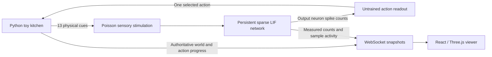

# Local neural experiment: implementation and reproduction

Implementation date: September 13, 2026. This document covers the optional Python engine and its original untrained baseline. The default experience now runs a separately audited browser engine; see [BROWSER_BRAIN.md](BROWSER_BRAIN.md).

## Scope of the claim

The local controller updates every neuron in our **167,216-node annotated MaleCNS cohort** and uses the imported sparse connectivity throughout an episode. It is not a cooking-specific subgraph. However, it is a highly simplified leaky integrate-and-fire (LIF) model. A complete wiring reconstruction does not supply a complete physiological model, sensory apparatus, muscle controller, memory, or learned recipe.

In **Free neural experiment**, the ingredients are engineered sensory cues. Authored movement skills execute choices from a seeded, untrained neural readout. The fly does not learn online. We claim a functioning, inspectable causal loop; we do **not** claim uploaded consciousness, biologically accurate whole-fly behavior, learned cooking, or an advantage over a random controller.

## Architecture and ownership



`brain/session.py` owns both the neural state and the world. `brain/server.py` serializes commands and simulation steps with an async lock. Numba runs outside the event loop in a worker thread. There is one session per server, shared by its viewers; viewing from a second device does not allocate another brain.

The original demo remains in `src/simulation.ts`. Its timeline, automatic ingredient additions, and `chefCue()` are bypassed in neural mode. `src/neural.ts` translates backend actions into poses. It checks the physical preconditions for tool animations, so an unsuccessful attempt to chop in the yard does not teleport Palov onto a cutting board. Six-leg support and tool inverse kinematics remain authored animation skills, not biological muscle simulation.

## Data, graph selection, and exact counts

Sources are the [official MaleCNS v1.0 flat connectome files](https://male-cns.janelia.org/download/), with synapse confidence threshold 0.5. The downloader verifies every byte against `brain/sources.lock.json` before use.

The importer retains an annotation row when:

```python
(status == "Traced") | superclass.notna()
```

It retains every positive-weight edge whose two endpoints are selected. It does not impose a minimum connection weight, choose recipe-related circuits, or silently reduce the graph for performance. The broader annotation rule includes some assigned but not fully traced bodies; it should not be substituted for the release’s headline neuron count.

| Item | This import |
|---|---:|
| Annotation rows | 211,577 |
| Selected neurons | 167,216 |
| Selected with status Traced | 165,122 |
| Other selected statuses | 2,002 unlabelled, 60 Anchor, 32 Orphan |
| Excluded annotation rows | 44,361 |
| Source connection-pair rows, including fragments | 151,856,684 |
| Retained directed weighted connections | 25,587,572 |
| Sum of retained synapse weights | 124,193,283 |
| Sensory superclass neurons | 17,937 |
| Descending/motor output neurons | 2,129 |
| Edges with zero fast-current sign | 1,114,935 |

A weighted connection is one neuron pair with an aggregate synapse count; it is not one individually simulated synapse. CSR files hold presynaptic row offsets, postsynaptic indices, and signed aggregate weights. They use int64 offsets, int32 targets, and float64 weights. Files are memory mapped at load time and verified against the processed manifest. Neuron IDs stay int64 in Python and strings in JSON.

Arrow record batches filter the large source table without a full in-memory fragment graph. `brain/data/processed/manifest.json` contains the filters, counts, transmitter totals, source hashes, and every derived file’s SHA-256. The recorded copy is [results/import-manifest.json](results/import-manifest.json).

## Neuron dynamics

The starting point is [Shiu et al., Nature 2024](https://www.nature.com/articles/s41586-024-07763-9) and their [public model implementation](https://github.com/philshiu/Drosophila_brain_model), pinned to commit `91bdd1e7dcf193f3e7ca5a8933497fcef63b7960`. The original reference dataset is FlyWire v630. Its neuron IDs are **not transferred** to MaleCNS.

Each neuron has membrane voltage `v` and a decaying synaptic-current variable `g`, expressed as a voltage:

```text
 dv/dt = (Vrest - v + g) / τmem
 dg/dt = -g / τsyn
 spike when v > Vthreshold
 on spike: v = Vreset; g = 0
```

| Parameter | Value |
|---|---:|
| Integration timestep | 0.1 ms |
| Rest / reset | −52 mV |
| Threshold | −45 mV |
| Membrane / synaptic time constants | 20 / 5 ms |
| Refractory interval | 2.2 ms |
| Synaptic delay | 1.8 ms |
| Current per signed synapse count | 0.275 mV |
| External stimulus voltage increment | 250 × 0.275 = 68.75 mV |

`brain/model.py` uses the exact linear subthreshold update. Its timestep schedule matches the tested Brian2 order: integrate, detect thresholds, deliver delayed arrivals and external events, then reset spiking cells. Refractory cells clamp both differential updates and incoming synaptic current. Stimulated input cells have zero refractory interval, following the reference configuration. Delayed arrivals persist in a 19-slot ring buffer. There is no background drive when the network starts at rest without sensory input.

Synaptic signs are a deliberately crude assumption: acetylcholine +1; GABA and glutamate −1; **all other or uncertain transmitters 0**. This includes histamine and neuromodulators. Zero-sign edges are preserved in the graph but deliver no fast current. Cell-specific receptors, graded transmission, heterogeneous delays, plasticity, modulatory dynamics, and electrical synapses are not modeled.

This omission matters: the selected R7p/R8p visual inputs are predominantly histaminergic, so their injected activity does not provide a faithful downstream visual pathway. The interface must not present these as validated vision. Odor/contact pathways still give a measured sensory-to-output response. Improving transmitter/receptor assumptions requires a new model version and new validation, rather than silently assigning every unknown cell an excitatory sign.

The numerical test uses a four-neuron circuit with strong excitation, actual delayed inhibition, and refractoriness. It injects identical external events into the Numba engine and independent Brian2 implementation, checks exact timestep spike identities, and compares terminal voltages/currents within `1e-9` mV. This verifies the implementation on that circuit, not every possible parameter setting or biological accuracy.

## Sensory encoder and untrained readout

`Kitchen.observe()` exposes ingredient proximity cues, temperature, contact, station presence, moisture, and smoke. It excludes recipe stage, reward, success criteria, and the next correct action.

Each normalized cue drives a designated sensory population at `140 × cue` Hz. Overlapping inputs sum, capped at 200 Hz. External events use per-step Bernoulli sampling (`rate × dt`), as in the discrete-time Poisson-input approximation, with a seeded NumPy PCG64 generator.

| Cue | Requested MaleCNS type |
|---|---|
| Oil / onion / lamb / carrot | ORN_DM1 / ORN_DM2 / ORN_DM3 / ORN_DM4 |
| Spice / garlic / rice | ORN_DL1 / ORN_VA2 / ORN_VM2 |
| Heat / contact | TRN_VP1m / BM |
| Prep / qazan visual cue | R7p / R8p |
| Moisture / smoke | ORN_VP4 / ORN_DC4 |

These names are assignments for an experiment, not claims that a fly neuron represents plov ingredients. If an exact type is absent, the importer records its class-based fallback and IDs in `channels.json`; an empty fallback fails import. In this release, moisture uses the recorded fallback of the first 32 olfactory sensory neurons by body ID because ORN_VP4 is absent.

Outputs are all neurons annotated `descending_neuron`, `vnc_motor`, or `cb_motor`. A fixed RNG seed **410** permutes those IDs into 21 disjoint pools, one per action. Every output neuron belongs to exactly one pool. Pool membership stays fixed across episode seeds.

For each pool, the readout averages `log(1 + firing rate)` over a 50 ms neural window. It centers and scales the 21 scores with a standard-deviation floor of 0.05, applies softmax with temperature 1.5, and samples an action using a separate PCG64 generator seeded `episode_seed + 10000`. If there are no output spikes it chooses `wait`, without a random-action fallback. The model keeps running during a multi-window action, but chooses again only when that action ends.

This is a small stochastic decoder using neural features. It does not receive kitchen state directly, and nothing trains its weights. Its arbitrary pool assignments provide no natural correspondence between fly motor commands and cooking. A silencing effect proves dependency on the neural features, not that the connectome improves task performance. Random-policy, rewiring, matched-feature, and held-out training comparisons remain future research.

The WebSocket metadata includes exact input IDs, output pool IDs, parameters, dataset, version, and sampled cell coordinates. Every decision log includes all scores and probabilities, so the selection is auditable.

## Environment and outcomes

`brain/kitchen.py` implements 21 actions: travel to prep/qazan/yard, pick one of seven ingredients, chop, add, stir, add water, raise/lower heat, cover/uncover, drop, wait, and serve.

Interactions require the appropriate station, held object, accessible pot, and free forelegs. They can fail. Dropped portions cannot be recovered within an episode. The heat model changes temperature, evaporation, browning, hydration, and burning over time. The controller can choose any action; precondition failures are recorded rather than replaced with a better action.

Serving succeeds only if all seven ingredients are present, carrots were chopped three times, lamb browning is at least 0.6, rice hydration at least 0.9, and burn below 0.25. Otherwise serving immediately fails. Burn reaching 1 ends the episode; 240 toy seconds without completion times out. These are transparent game rules, not measurements of real culinary chemistry. The serving criteria currently do not evaluate ingredient order or realism of the entire recipe.

Rewards record unique preparation, ingredient transfer, failure penalties, and serving. They are not fed back into the actor, and there is no learning. The evaluation-only scripted baseline in `brain/tests/test_kitchen.py` can serve successfully in 157.5 toy seconds with no mistakes. The live session never imports or invokes it.

## Clocks, protocol, and display

Each step advances **0.05 neural seconds**, followed by **0.25 toy kitchen seconds**. The 5:1 mapping is an explicit interface choice, not a biological-time claim. The server caps fast updates at roughly 8.3 per wall second; if computation is slower, it waits for computation. It never drops neural timesteps to accelerate cooking.

`/api/neural/ws` sends metadata once, then snapshots with protocol version 1, a run UUID, monotonically increasing sequence, neural/world clocks, chosen action, world state, population rates, sample spike counts, and process timing/memory. Commands carry the current run ID; stale commands after a reset are rejected. Browser controls are acknowledged through authoritative snapshots. Heartbeats keep idle connections observable.

The viewer interpolates only between received world states, without extrapolating a new action or success. The brain display uses the latest measured 50 ms counts directly: no random firing generator, sine-wave activity, or decorative connections are mixed into neural mode. Population mean rates include silent neurons and cover all selected sensory/other/output cells. The visual sample is biased toward outputs and is not used to compute those full-population rates.

The 1,678 displayed cells comprise 30 sensory, 400 output, and 1,248 other neurons with available somas. Coordinates come from source `somaLocation`, recorded in 8 nm EM voxels, centered/scaled and displayed as `x, −z, y`. This plots both brain and ventral nerve cord somas; it is not a mesh, neuron arbor skeleton, synapse map, or natural brain recording.

Commands, simulation steps, and checkpoint writes are serialized. Slow viewers receive the newest state instead of an unbounded backlog. A started session now continues without viewers. Explicit pause stops it; browser disconnection only freezes that viewer. The optional `--continuous` recipe mode cycles the menu after completed dishes. Browser offline events and a 15-second heartbeat timeout freeze the last frame and require explicit reconnection. A reconnect while other viewers are running joins that shared session.

## Checkpoints and reproducibility

Each checkpoint directory contains compressed `brain.npz` arrays and an atomically finalized `state.json`:

- voltage, synaptic current, last-spike steps, delayed-arrival queue, latest counts;
- timestep, total spikes, parameters, graph hashes, and stimulus RNG state;
- decoder version, seed, and action RNG state;
- complete kitchen, pending action, event history, interventions, and run provenance.

Restore verifies graph hashes and neuron parameters and uses `allow_pickle=False`. It opens a new run UUID and starts paused. Identical future stimuli and commands reproduce the saved trajectory on the tested environment. Cross-platform floating-point differences can affect threshold crossings; bit-identical trajectories on different CPU architectures are not promised.

On graceful shutdown the server finishes the active kernel and saves a checkpoint. To restore one into a new server process:

```sh
uv run --frozen python -m brain.server --checkpoint brain/runs/checkpoint-EXACT-NAME
```

Run Vite separately in another terminal for this command. Sudden process termination or power loss cannot guarantee a final save. Saved checkpoint files survive server restarts; the UI’s “Restore saved state” refers to the last checkpoint loaded or saved in that server session.

## Measured evidence on this machine

The compact JSON artifacts under `docs/results/` record the platform, dependency versions, seeds, raw measurements, and scope of each check. Re-run the commands in [README](../README.md) to get your own `brain/runs/` results. Warm-up, browser rendering, CPU contention, and workload activity affect speed; the displayed rate is measured rather than advertised as guaranteed real time.

The reference sugar experiment used three seeds with one neural second per trial. Its MN9 output fired at **61, 66, and 69 Hz** under 100 Hz sugar stimulation, versus **0 Hz** with no input or silenced sugar outgoing connections. It ran the upstream file unchanged. The initial report writer hit a NumPy boolean serialization error after all nine trials completed; its original report explicitly records recovery of the unchanged trial rows from captured stdout. The writer has been corrected and independently smoke-tested on three 0.1-second trials, with MN9 rates 0 / 60 / 0 Hz and a successfully written report: [reference-writer-smoke-m5.json](results/reference-writer-smoke-m5.json).

Full-graph causality checks restart each condition from rest for seeds **17, 29, 43**, with 0.5 neural seconds each. All pass: prep cues reach motor/descending outputs; no input is silent; silenced outputs give no active choice while other neurons still fire; different sensory contexts change the decoder’s action distribution. These are engineering interventions, not a trained cooking evaluation.

The first recorded untrained episode, seed **17**, selected 19 actions in 25 toy seconds (5 neural seconds), made 14 mistakes, and served an empty qazan. It ended `failed_recipe`, with 3,634,067 simulated spikes. A second independent run reproduced the action outcomes, timing in simulated units, mistakes, and total spike count exactly; see [repeatability-m5.json](results/repeatability-m5.json). This is an observed failed attempt, not evidence of learned cooking.

See [benchmark-m5.json](results/benchmark-m5.json) for the exact timing and memory of the saved full-graph benchmark. The reference protocol and fast adaptation use different datasets and runtimes; their speeds should not be treated as an optimization comparison.

At the original baseline, application checks passed: **19 Python tests, 12 TypeScript tests, 5 browser tests**, production build, and Ruff. [validation.json](results/validation.json) records commands, execution scope, remaining dependency/build/audit warnings, and source-file hashes.

## What remains before stronger claims or hosting

The current implementation deliberately establishes a local, reproducible baseline. Next work would be validating sensory mappings and transmitter assumptions, training and evaluating a clearly identified readout, testing against matched non-connectome baselines, and assessing held-out task success. Biological leg control would require a separate body/physics model and validated motor interface.

For public hosting, retain the separation between the static viewer and the stateful simulation. Add authenticated controls, viewer limits, durable checkpoints, supervised process recovery, and measured capacity under real traffic. No hosting service or paid infrastructure is provisioned by this implementation.


## Authored recipe option added September 13

The local server now starts paused in recipe mode. `brain/recipe.py` follows the shared `shared/recipes.json` catalog with world-state feedback, enforcing ingredient order, brown-before-carrots, three carrot chops, zirvak before rice, no post-rice stirring, low-heat covered steaming, rest and serving checks. It uses a 360-kitchen-second budget. `Session` itself and the benchmark CLI still default to the original untrained neural controller so baseline runs remain explicit and reproducible. The 21 legacy neural action pools are unchanged; recipe-only extra ingredients do not alter their mapping.

All four local recipes completed pure kitchen-policy tests without mistakes. A complete wedding recipe with the full local graph completed 199 actions in 277.5 kitchen seconds / 55.5 neural seconds, with zero mistakes and 32,843,101 spikes. Wall time was about 380 seconds during development load. This is authored recipe success, not learned neural cooking. The browser’s separate neural portion feature is documented separately and is not silently asserted for the local recipe policy.

Snapshots carry the controller identity and recipe progress. Cooking logs capture completed actions, instructions, ingredients, temperature, hydration, browning, heat and spike totals. `/api/neural/cooking-log` exports a current report; `/api/neural/history` lists retained completed episodes. Recipe traces and cooking archives retain 200 entries each; checkpoints and existing untrained logs are outside this retention rule. Checkpoints include recipe state and cooking logs and restore paused. User controls, rather than a timeout, choose resets.
